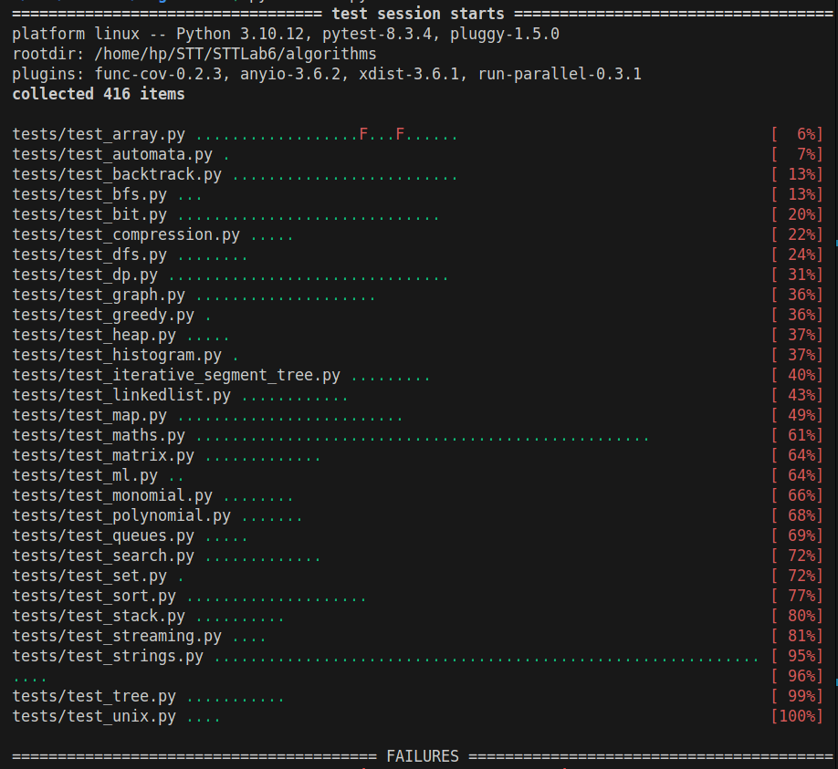
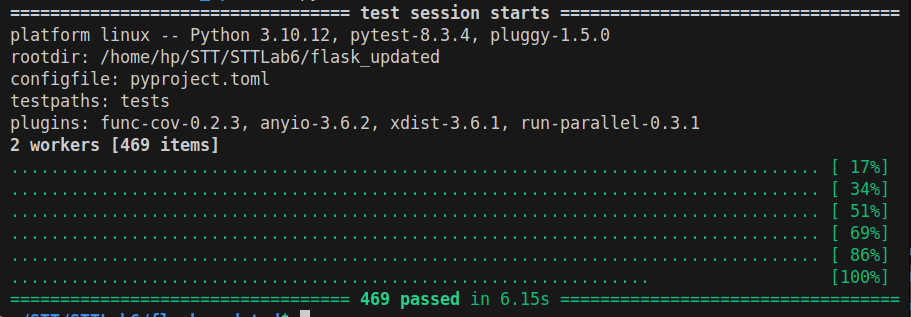
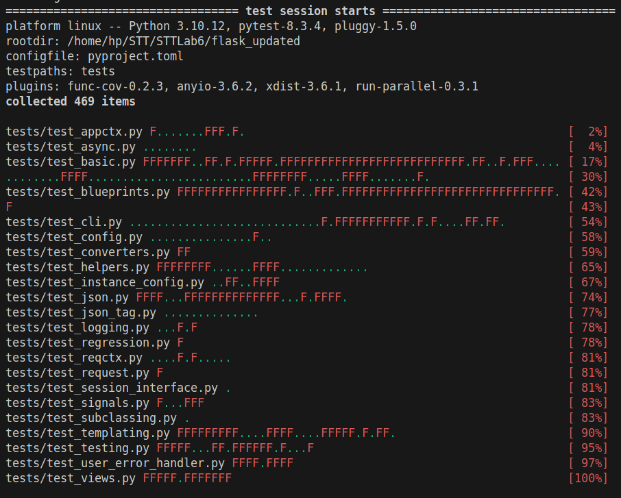
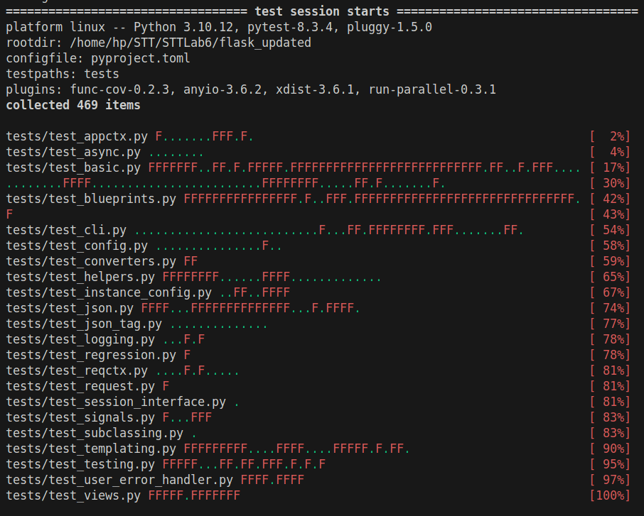
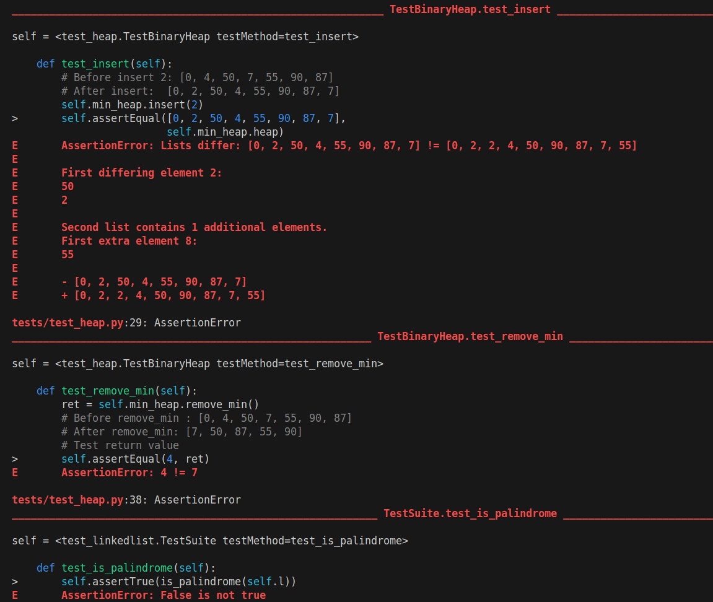
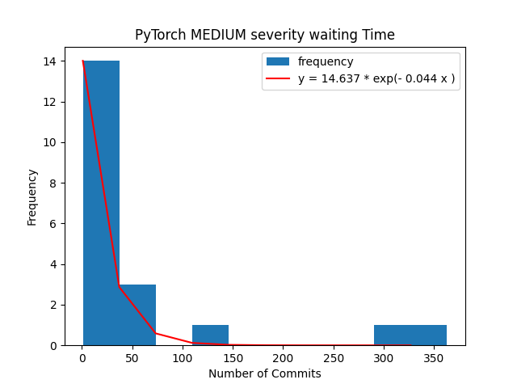

# Lab 5

## Introduction

This lab explores automated testing techniques to improve the quality and reliability of Python software. It leverages a suite of industry-standard tools and frameworks, each playing a crucial role in the testing process:

- **PyTest**  
  A robust testing framework that simplifies writing and executing tests for Python projects. Its flexibility and extensive ecosystem—including plugins like pytest-cov and pytest-func-cov—make it an essential component for continuous integration and quality assurance workflows. [PyTest Documentation](https://docs.pytest.org/en/7.4.x/index.html)

- **Coverage**  
  A tool that measures which parts of the code are executed during tests, helping developers identify untested sections. Integrated with PyTest via plugins like pytest-cov, it provides detailed insights into test effectiveness. [Coverage Documentation](https://coverage.readthedocs.io/en/latest)

- **Pynguin**  
  An automated test case generation tool that creates test cases aiming to increase code coverage. While Pynguin can identify and exercise more code paths—raising coverage metrics—it often requires manual refinement to validate correct behavior. [Pynguin Website](https://www.pynguin.eu)

- **Additional Plugins: pytest-cov & pytest-func-cov**  
  These plugins seamlessly integrate coverage analysis into the PyTest workflow, providing developers with immediate feedback on test coverage during routine test execution. [pytest-cov](https://github.com/pytest-dev/pytest-cov) | [pytest-func-cov](https://pypi.org/project/pytest-func-cov)

Testing can broadly be divided into static and dynamic approaches, each with distinct characteristics:

- Static Testing: 
  - Sound but Imprecise: It aims to be conservative by over-approximating potential issues, which can result in imprecision.  
  - Input-Oblivious: Static techniques analyze code without executing it, meaning they do not account for runtime input variations.

- Dynamic Testing:
  - Incomplete but Precise: It may not cover every possible execution path, as it relies on specific input data to drive the tests.  
  - Input-Dependent: By executing the code, dynamic testing provides precise feedback for the specific scenarios tested.

The purpose of this lab is to explore dynamic testing techniques, focusing on improving code coverage in a Python project. The lab demonstrates how PyTest and Coverage can be used to measure existing test effectiveness, followed by an experiment using Pynguin to automatically generate additional test cases. 

The lab ultimately reinforces the idea that automated test generation can be a useful supplement to human-written tests, improving coverage and potentially detecting edge cases. However, manual verification remains essential to ensure the quality and correctness of the generated test cases.


## Methodology and Execution

- Cloning the repository
    
    
    
    Since the latest commit didn’t have a green tick, I reverted back to the last one which did, which has hash `1117ffe` .
    
    
    
- testing using `pytest`
    
    
    
- Getting line coverage using `coverage`
    
    First I ran :
    
    ```
    coverage -m pytest tests
    ```
    
    This gave me the same output as simply running `pytest` , but allowed line coverage to be recorded too.
    Then, I created a HTML visualisation like this :
    
    
    
    
    
    
    
    Thus, there is only 90% code coverage.
    
    We want more than that, and so we will generate another test case suite using `pynguin`.
    
    We first get the files with uncovered lines and store it in a text file
    
    
    
    Then, with the help of a simple python script, we change this to a usable format, like this :
    
    
    
- Generating test cases
    
    Then, we programmatically run `pynguin` for all these files using this script :
    
    ```python
    import os
    from multiprocessing import Process, Queue
    import time
    L = open("test_A_uncov_clean.txt",'r').read().split("\n")
    dt = 5
    T = 120
    def run_pynguin(x):
        y =  x.split("/")
        project = "/".join(y[:-1])
        module = y[-1][:-3]
        command = f"pynguin --project-path {project} --output-path pynguin-results --module-name {module} --maximum-search-time 60 --maximum-test-execution-timeout 60"
        print(command)
        os.system(command)
    for x in L:
        kill = False
        finished = False
        queue = Queue()
        p = Process(target=run_pynguin,args=(x,))
        p.start()
        t0 = time.time()
        while not kill and not finished:
            time.sleep(dt)
            t = time.time()
            t = t - t0
            if not p.is_alive():
                finished = True
            elif t > T:
                print(f"killed pynguing for {x}")
                kill = True
        if kill:
            while p.is_alive():
                os.system(f"kill -9 {p.pid}")
        else:
            p.join(10)
            #RETURN_VALS = queue.get(timeout=10)
    
    ```
    
    The output thus generated is
    
    1. The test cases in `pynguin-results/` (which, we will call test suit B) :
        
        
        
    2. The code coverage of the files using the generated test-cases :
        
        
        
    
    We can use the `statistics.csv` and the `test_A_uncov.txt` files to analyse how the generated test cases differ from the old ones. I’m using this script for the analysis:
    
    ```python
    import matplotlib.pyplot as plt
    import pandas as pd
    data = pd.read_csv('test_A_uncov_clean.csv').drop_duplicates(subset='TargetModule')
    new_data = pd.read_csv('pynguin-report/statistics.csv').drop_duplicates(subset='TargetModule')
    new_data["Coverage"] = new_data["Coverage"].astype('float')
    data["Coverage"] = data["Coverage"].astype('float') / 100
    data.index = data["TargetModule"]
    new_data.index = new_data["TargetModule"]
    data = data.drop(columns=["TargetModule"])
    new_data = new_data.drop(columns=["TargetModule"])
    data = data.sort_index()
    new_data = new_data.sort_index()
    data = data.join(new_data, rsuffix="_new")
    print("Old average coverage:",data["Coverage"].mean())
    print("New average coverage:",data["Coverage_new"].mean())
    data.plot.scatter(x='Coverage', y='Coverage_new')
    plt.xlabel("Old Coverage")
    plt.ylabel("New Coverage")
    plt.savefig("Coverage.png")
    ```
    
    Output:
    
    ```python
    Old average coverage: 0.7631746031746034
    New average coverage: 0.817315261873147
    ```
    
    
    
    Note that this output is only for the files where code coverage was already low.
    
    It shows that `pynguin` increases code coverage only slightly.
    
- Running `pytest` on test suite B
    
    The directory structure makes our generated tests unusable with `pytest` . So, using this script, I merged the `algorithms` and `pynguin-results` directories into `test_suit_B` :
    
    ```python
    import os
    folder = "test_suit_B"
    def pull_up(folder):
        for subfolder in os.listdir(folder):
            if subfolder[-3:] == ".py":continue
            if subfolder == "__pycache__":continue
            #if subfolder == "pynguin-results":continue
            sf = folder + "/" + subfolder
            pull_up(sf)
            try:L = os.listdir(sf)
            except:continue
            for x in L:
                if x == "__init__.py":continue
                if x[-3:] != ".py":continue
                file = sf + "/" + x
                upper = folder + "/" + x
                print(file)
                file = open(file, "r")
                s = file.read()
                file.close()
                try:
                    upper = open(upper, "a")
                    upper.write("\n\n\n")
                except:upper = open(upper, "w")
                upper.write(s)
                upper.close()
    pull_up(folder)
    ```
    
    Then, the output of running `pytest` was:
    
    
    
    So, the tests, although do cover a bit more code are mostly wrong, since there is a massive difference between the outputs of test suite A and B upon running `pytest` .

## Results

There is only 90% code coverage in the actual test suite for `keon/algorithms` . 

After collecting all the units with low covered line, we get a coverage of 76.3 % on these units. 

When test cases are generated using `pynguin`, this improves to 81.7 % ,that is, there is some marginal improvement. 

This improvement is mostly due to increased coverage in modules with extremely low coverage, as seen in this plot :


Of course, the "tests" generated by `pynguin` are nothing but inputs that allow good line coverage, where the expected output in the test case isn't the correct output in the majority of generated test cases. So, a human must intervene and "fix" these tests. This, will lead to somewhat better code coverage in the end and is a time-effective way that doesn't rely on developers manually writing unit tests.

## Conclusion

PyTest, combined with `coverage`, is an invaluable toolset for testing Python modules and analyzing code coverage. These tools streamline the testing process, making it easier to identify untested portions and improve software reliability.

Automating test case generation with tools like Pynguin can further enhance efficiency. While Pynguin increases code coverage, as shown by the improvement from 76.3% to 81.7%, its generated test cases often require manual corrections. These tests execute more code but do not always validate correct program behavior, making human oversight essential.

A balanced approach is ideal: Pynguin can generate an initial batch of test cases, which developers then refine to ensure correctness. This hybrid method leverages automation for efficiency while maintaining accuracy, leading to more reliable and maintainable test suites.

# Lab 6

## Introduction

`pytest` is a PyPi package that is used to automate testing. This framework is used typically for many small unit tests, but also supports complex functional testing. Pytest provides detailed assertion introspection using nothing but plain `assert` statements.

`pytest-xdist` is a plugin for pytest that allows new execution modes, namely multi processing. This is usually used to speed up execution.

`pytest-run-parallel` is a plugin that runs tests that were supposed to be run sequentially, in parallel using very unsafe multi-threading. This is NOT a tool for achieving a speedup during automation. Instead, this was designed to discover thread-safety issues that arise when using C libraries.

The objective of this lab is to understand the usage of `pytest` and how it is altered when using the plugins mentioned above.

## Methodology and Execution

I'll be using [Flask](https://github.com/pallets/flask) as my second repository for this lab (where `keon/algorithms` is the first). For flask, I've used the version with commit hash `f61172b8dd3f962d33f25c50b2f5405e90ceffa5` , while for the Algorithms repository, I am using the version with commit hash `cad4754bc71742c2d6fcbd3b92ae74834d359844`, which as-of-now is the latest commit.

### Sequential Test execution for Flask

I ran `pytest` 10 times and removed any failing or flaky tests I saw.

Before disabling failing tests:


After disabling failing tests:


execution times on running all tests, and doing this 3 times are :

|Turn| time (s)   |
|----|------------|
|1   | 6.05       |
|2   | 6.55       |
|3   | 5.78       |
|**Mean**|**6.13**|

### Sequential Test execution for Algorithms

There was a small error in the test suite. After fixing that, I proceeded as usual.

Before disabling failing tests:



After disabling failing tests:


execution times on running all tests, and doing this 3 times are :

|Turn| time (s)   |
|----|------------|
|1   | 8.20       |
|2   | 8.58       |
|3   | 8.49       |
|**Mean**|**8.42**|

### Parallel Test execution for Flask

The PyPI package `pytest-xdist` extends `pytest`'s functionality by adding thread level and process level parallelism.

An example of process level parallelism is as follows:

```sh
pytest -n auto
```

This generates output like this:



Running this 3 times gives :

|Turn| time (s)   |
|----|------------|
|1   | 6.15       |
|2   | 6.14       |
|3   | 7.07       |
|**Mean**|**6.45**|

### Parallel Test execution for Algorithms

```sh
python3 -m pytest tests -n auto
```

outputs :


Running this 3 times gives :

|Turn| time (s)   |
|----|------------|
|1   | 9.86       |
|2   | 9.42       |
|3   | 9.50       |
|**Mean**|**9.59**|

### Observations

As you can see, instead of the run-time getting reduced, it increased slightly. This is because initializing the extra workers takes a lot of time, and during that time,
execution proceeds as if it is just serial execution, except with an overhead. This is a known and [discussed](https://github.com/pytest-dev/pytest-xdist/issues/346) flaw in `pytest-xdist` . 

### Flask `pytest` testing with different parameters

#### Process level parallelism

```sh
pytest -n auto --dist load
```
gives run-times of 6.16, 6.43, 6.21 seconds and thus mean of 6.50s

```sh
pytest -n auto --dist no
```
gives run-times of 6.61, 6.34, 6.57 seconds and thus mean of 6.50s

#### Thread level parallelism

```sh
pytest --parallel-threads auto --dist load --tb=no --disable-warnings
```

gives this output :



and run times of 11.63, 11.68, 12.24 seconds giving a mean of 11.85s

This is because Flask is very sensitive about timings, since it is used to deploy websites via a server.

Similarly,

```sh
pytest --parallel-threads auto --dist no --tb=no --disable-warnings
```

gives this output full of failures :



and runtimes of 11.31, 12.01, 11.61 seconds giving a mean of 11.64

### Algorithms `pytest` testing with different parameters

#### Process level parallelism

```sh
python3 -m pytest tests -n auto --dist load
```
gives run-times of 9.07, 8.54, 8.93 seconds and thus a mean of 8.85s


and

```sh
python3 -m pytest tests -n auto --dist no
```
gives run-times of 8.34, 8.54, 17.80 seconds and thus a mean of 11.56s


This abnormally high amount of time in one of the executions is attributed to the time needed to allocate workers, since we are running CPU intensive workloads, which, unfortunately puts our workload at the lowest priority for the OS.

#### Thread level parallelism

```sh
python3 -m pytest tests --parallel-threads auto --dist load --tb=no --disable-warnings
```

gives this output :


Although there aren't a lot of failures, this suggests that either `keon/algorithms` contains code which does not take 
multithreading into account, or the `pytest-run-parallel` developers were not careful during the implementation. With multithreading,
a lot could go wrong. In our case, we are dealing with a classic case of race conditions. Since both threads have the same address space,
the variables are not updated atomically at times, leading to problems such as more than necessary removals of elements from lists,
value of a counter variable being less than what it should be, etc. . Similar things are happening here.



This can be solved by using locks while writing the threads.

Now, the run-times for this are 37.10, 38.90, 36.98 seconds giving a mean of 37.66s

Similarly,

```sh
python3 -m pytest tests --parallel-threads auto --dist no --tb=no --disable-warnings
```

gives the same failures and runtimes of 37.84, 35.89, 35.03 seconds giving a mean of 36.25s

## Analysis

From the data we collected, and some more, we have this information :

### Flask

#### Run-time

| Type of parallelism            | `--dist load` | `--dist no` |
| ------------------------------ | ------------  | ----------- |
| None                           |               | 6.43        |
| Process level (2 Processes)   | 6.50          | 6.50        |
| Thread level (2 threads)       | 11.85         | 11.64       |
| Process and Thread (2 workers) | 9.29          | 10.40       |

#### Fraction of failed tests

| Type of parallelism            | `--dist load` | `--dist no`  |
| ------------------------------ | ------------  | ------------ |
| Process level (2 Processes)   | 0/469         | 0/469        |
| Thread level (2 threads)       | 247/469       | 248/469      |
| Process and Thread (2 workers) | 249/469       | 246/469      |

### Algorithms

#### Run-time

| Type of parallelism            | `--dist load` | `--dist no` |
| -----------------------------  | ------------  | ----------- |
| None                           |               | 8.42        |
| Process level (2 Processes)   | 8.85          | 11.56       |
| Thread level (2 threads)       | 37.66         | 36.25       |
| Process and Thread (2 workers) | 31.10         | 32.03       |

#### Fraction of failed tests

| Type of parallelism            | `--dist load` | `--dist no` |
| -----------------------------  | ------------  | ----------- |
| Process level (2 Processes)   | 0/414         | 0/414       |
| Thread level (2 threads)       | 3/414         | 3/414       |
| Process and Thread (2 workers) | 3/414         | 3/414       |

## Conclusion

As is evident from the data, process level parallelism doesn't introduce more failures in the tests.
This is because each process has its own virtual address space. Thus, the processes can run as if they are on separate CPUs.
Meanwhile, for threads, we need concurrency control and execution ordering to ensure correct functioning and avoid race conditions.
This is to handled by the programmer, using the concurrency control API that the OS provides.
The programmer also has to avoid deadlocks and other hazards.

theoretically, multithreading and multiprocessing should increase the throughput, but here we see the opposite. This can be explained as:
1. Multithreading causes incorrect program execution here, since there are no declared critical sections in most files.Thus, many instructions that should've ran atomically, don't.
   This changes the run-time of the program directly, as its execution is altered.
2. For CPU intensive workloads, such as one in the Algorithms repository, having parallelism doesn't produce a speed-up, since now, both cores run both IO intensive and CPU intensive jobs,
   compared to one running IO intensive jobs predominantly, and other running CPU intensive jobs
   There can be a lot of context switching, but it doesn't change the fact, that the combined workload (system + jobs) is the same, AND the processing power is also still the same.
   In-fact, if anything, having multiple processes causes more problems due to the context switching, and the cache losing its usefulness constantly.
   Meanwhile, for IO intensive jobs, since the delay time is reduced, so the job finishes quicker theoretically.
   In practice, because of the overheads involved with acquiring the workers, the execution time is similar to sequential execution.

### Suggestions to the `pytest` developers :

Parallelism is a nice feature to have if it provides speedup. Currently, since the `pytest-xdist` plugin doesn't produce a speed-up for the usual type of test suites that pytest is utilised for, i.e. small tests cases, so improving the run-times for execution with parallelism is a necessary advancement to incorporate these features in `pytest`.


# Labs 7 and 8

## Introduction

### CWE

Vulnerabilities in software and hardwares are harder to fix when the product is already in deployment. For this reason, developers and designers often refer to the [Common Weakness Enumeration](https://cwe.mitre.org/data/index.html) (CWE), which is a list of common weaknesses, where a "weakness" is any condition that could, under certain circumstances create vulnerabilities.
It's beneficial to catch such conditions early on, during the design and development stages of a product in its lifecycle, which usually goes like this:
1. Plan and Analyse
2. Design (potential introduction of weakness)
3. Develop (potential introduction of weakness)
4. Test
5. Deploy (vulnerability discovered)
6. Maintain (vulnerability discovered)

### Bandit

> Bandit is a tool designed to find common security issues in Python code. To do this Bandit processes each file, builds an AST from it, and runs appropriate plugins against the AST nodes. Once Bandit has finished scanning all the files it generates a report.
    - [Bandit GitHub repository](https://github.com/PyCQA/bandit)

## Methodology

### Repository selection

For this lab, I will be using python modules that are used for scientific and numeric computation and training ML models, namely:
1. [NumpPy](https://github.com/numpy/numpy)
2. [OpenCV](https://github.com/opencv/opencv-python)
3. [PyTorch](https://github.com/pytorch/pytorch)

### Running Bandit

I use the following script (`get_commits.py`) to programatically get the commits using Pydriller, and then run `bandit` on the new source code of the files changed. Note that I'm not limiting myself to just 100 commits, and am instead using 1000 commits. 

```python
import sys,csv,os,pandas
from pydriller import Repository
def get_commits(url,name):
    columns = ["old_file path","new_file path","commit SHA","parent commit SHA","new_file_MCC"]
    band = ["test_name","test_id","issue_severity","issue_confidence","line_number","col_offset","end_col_offset","line_range","issue_cwe"]
    columns.extend(band)
    rows = []
    count=0
    last_n=1000
    commits = []
    Repo = Repository(url,only_no_merge=True,order='reverse',num_workers =1,histogram_diff = True,skip_whitespaces=True)
    for x in Repo.traverse_commits():
      if (x.in_main_branch==True):
        count=count+1
        commits.append(x)
        if count == last_n:break
    in_order = []
    for value in range(len(commits)):in_order.append(commits.pop())
    commits=in_order
    for i,commit in enumerate(commits):
      print(f'[{i+1}/{len(commits)}] Mining commit {url}/commit/{commit.hash}')
      diff = []
      try:
        for m in commit.modified_files:
          if len(commit.parents) > 1:continue
          src = m.source_code_before
          dst = m.source_code
          if dst == None:continue
          f = open('temp.py','w')
          print(f'\t Mining file {m.new_path}')
          f.write(dst)
          f.close()
          os.system("bandit temp.py -f csv -o temp.csv > /dev/null 2>&1")
          df = pandas.read_csv('temp.csv')[band]
          L = df.values.tolist()
          r0 = [m.old_path,m.new_path,commit.hash,commit.parents[0],m.complexity]
          if len(L) == 0:rows.append(r0 + [None]*len(band))
          else:
            for r in L:rows.append(r0 + r)
      except:pass
    try:os.mkdir(name+'_results')
    except:pass
    f = open(name+'_results/commits_info.csv', 'w')
    f.write("")
    f.close()
    with open(name+'_results/commits_info.csv', 'a') as csvFile:
      writer = csv.writer(csvFile)
      writer.writerow(columns)
      writer.writerows(rows)
    csvFile.close()
    print('Commits info saved in '+name+'_results/commits_info.csv')

Reps = {
    "NumPy":"https://github.com/numpy/numpy",
    "OpenCV":"https://github.com/opencv/opencv-python",
    "PyTorch":"https://github.com/pytorch/pytorch",
}

if __name__ == "__main__":
    for name in Reps:get_commits(Reps[name],name)
```

The output of this are these files:

- `NumPy_results/commits_info.csv`
- `OpenCV_results/commits_info.csv`
- `PyTorch_results/commits_info.csv`
  
Each of these have these columns :

- `old_file path`
- `new_file path`
- `commit SHA`
- `parent commit SHA`
- `commit message`
- `new_file_MCC`
- `test_name`
- `test_id`
- `issue_severity`
- `issue_confidence`
- `line_number`
- `col_offset`
- `end_col_offset`
- `line_range`

### Research Questions

We will now be looking at some interesting aspects on the output, mainly, we will be answering these questions :

---

##### RQ1
When are vulnerabilities with high severity, introduced
and fixed3 along the development timeline in OSS repositories?

---

##### RQ2
Do vulnerabilities of different severity have the same
pattern of introduction and elimination?

---

##### RQ3
Which CWEs are the most frequent across different
OSS repositories?

---

### Identification of vulnerability fixes.

First, let's find what are some definitive aspects of a particular vulnerability / issue in a file ?
By definitive, I mean facts that don't change as the repository evolves.
Since we are restricted to the output that we get from Bandit, I'll use these features to try to uniquely identify an issue:

1. File Name (I'll assume there are no file renaming)
2. Bandit Test ID (This maps to a unique CWE-ID for Python source code)
3. Issue Severity
4. Issue Confidence
5. `col_offset`
6. `end_col_offset`
7. length of `line_range` (which is a list)

All these have hashable type (strings and integers), and so, a 7-tuple with these as elements, in that order, is also hashable. So, we can store a hash-map with the issues as keys, and the issue introducing and fixing pair as the value.

To identify whether an issue has disappeared in a file after a commit, we simply have to check if it is not in Bandit's output for the particular file, if modified. If the file isn't modified, we don't do anything.
From the "Badness" graphs, whe can see that at any give time, there are no more than $ N =100 $ issues in repository. So, for $ C = 100 $ commits, our $ O(CN^2) $ algorithm will run in appropriate time.

To do this, I'm using this program (`RQ.py`) :

```python
import pandas as pd
import numpy as np
import matplotlib.pyplot as plt
import os
from scipy.optimize import curve_fit
files = ["NumPy_results/commits_info.csv","OpenCV_results/commits_info.csv","PyTorch_results/commits_info.csv"]

def to7tuple(x):
    return (
        x[1], # file path
        x[6], # test_id
        x[7], # issue_severity
        x[8], # issue_confidence
        int(x[10]), # col_offset
        int(x[11]), # end_col_offset
        len(x[12].split(",")) # length of line_range
        )

def get_pairs(file):
    data = list(pd.read_csv(file).values)
    data = [[x if x is not np.nan else None for x in y] for y in data]
    print(len(data))
    last_commit = None
    t = 0
    Done = []
    Current = {}
    IssuesFound = {}
    for x in data:
        commit = x[2]
        if commit != last_commit:
            # Complete issues that were not found in the last commit
            for file_path in Current:Current[file_path] = set(Current[file_path])
            torem = []
            for issue in IssuesFound:
                file_path = issue[0]
                if file_path not in Current:continue # The file was not modified in the last commit
                found = Current[file_path] # The issues found in the last commit
                if issue not in found:
                    Done.append(issue + IssuesFound[issue] + (last_commit,t))
                    torem.append(issue)
            for issue in torem:del IssuesFound[issue]
            # Add all issue gathered from the last commit to the IssuesFound
            S = 0
            for file_path in Current:
                S += len(Current[file_path])
                for issue in Current[file_path]:
                    IssuesFound[issue] = (last_commit,t)
            t += 1
            last_commit = commit
            Current = {}
        file_path = x[1]
        severity = x[7]
        test_id = x[6]
        if test_id is None:
            torem =[]
            for issue in IssuesFound:
                if issue[0] == file_path:
                    Done.append(issue + IssuesFound[issue] + (commit,t))
                    torem.append(issue)
            Current[file_path] = []
            for issue in torem:del IssuesFound[issue]
        else:
            y = to7tuple(x)
            if file_path in Current:Current[file_path].append(y)
            else: Current[file_path] = [y]
    return Done


def plot_pairs(csvfile):
    data = pd.read_csv(csvfile)
    data = data.dropna()
    data = data.values
    severity = data[:,2]
    confidence = data[:,3]
    col_offset = data[:,4]
    end_col_offset = data[:,5]
    line_range = data[:,6]
    commit = data[:,7]
    commit_number = data[:,8]
    fix_commit = data[:,9]
    fix_commit_number = data[:,10]
    wait = fix_commit_number - commit_number
    # draw histograms for severity and confidence
    plt.figure()
    plt.subplot(1,2,1)
    plt.hist(severity)
    plt.title("Severity")
    plt.subplot(1,2,2)
    plt.hist(confidence)
    plt.title("Confidence")
    plt.savefig(csvfile[:-4]+"_fix_hist.png")
    # draw timeline for introduction and fixing of issues
    Map = {"LOW":1,"MEDIUM":2,"HIGH":3}
    plt.figure()
    plt.bar(commit_number,[Map[x] for x in severity],color = 'blue')
    plt.bar(fix_commit_number,[- Map[x] for x in severity],color = "red")
    plt.ylabel("Severity")
    plt.xlabel("Commit Number")
    plt.yticks([-3,-2,-1,1,2,3],["H","M","L","L","M","H"])
    name = csvfile.split("/")[-1].split("_")[0]
    plt.title(f"{name} Issue Timeline")
    plt.grid(True)
    # show x axis
    plt.plot([0,fix_commit_number[-1]],[0,0],color = "black")
    plt.legend(["Timeline","Introduction","Fixing"])
    plt.ylim(-4,4)
    plt.savefig(csvfile[:-4]+"_timeline.png")
    # draw histogram for waiting time where severity is high,medium and low
    big = 0
    for s in ["LOW","MEDIUM"]:#High not included coz it has no issues
        plt.figure()
        w = wait[severity == s]
        plt.hist(w,label="frequency")
        nam = csvfile.split("/")[-1].split("_")[0]
        plt.title(f"{nam} {s} severity waiting Time")
        plt.xlabel("Number of Commits")
        plt.ylabel("Frequency")
        # plot exponential fit
        P = plt.gca().patches
        x = np.array([p.get_x() for p in P])
        y = np.array([p.get_height() for p in P])
        def func(x, a, b):return a * np.exp(-b * x)
        popt, pcov = curve_fit(func, x, y)
        plt.plot(x, func(x, *popt), 'r-', label='fit: a=%5.3f, b=%5.3f' % tuple(popt))
        plt.legend()
        plt.savefig(csvfile[:-4]+f"_wait_hist_{s}.png")
    plt.close()

if __name__ == "__main__":
    for file in files:
        print(file)
        pairs = get_pairs(file)
        print(len(pairs))
        with open(file[:-4]+"_pairs.csv","w") as f:
            f.write("file_path,test_id,issue_severity,issue_confidence,col_offset,end_col_offset,line_range,commit,commit_number,fix_commit,fix_commit_number\n")
            for pair in pairs:f.write(",".join([str(x) for x in pair])+"\n")

    print("Plotting")
    for file in files:
        plot_pairs(file[:-4]+"_pairs.csv")

    print("Done")
```


### Repository specific analysis

I'm going to use this Python script (`analysis.py`) to analyse the CSV files that were written using `get_commits.py` .

```python
import pandas as pd
import numpy as np
import matplotlib.pyplot as plt
import os

def analyse(csvfile):
    data = pd.read_csv(csvfile).dropna(inplace=False)
    title = csvfile.split('_')[0]
    print(f'Analysing {title}')
    intensities = ["LOW","MEDIUM","HIGH"]
    counts = [[0]*3 for i in range(3)]
    for i in range(3):
        for j in range(3):
            counts[i][j] = sum((data['issue_severity'] == intensities[i]) & (data['issue_confidence'] == intensities[j]))
    plt.imshow(counts,cmap='Reds')
    plt.xlabel('Confidence')
    plt.ylabel('Severity')
    plt.xticks(np.arange(3), intensities)
    plt.yticks(np.arange(3), intensities)
    for i in range(3):
        for j in range(3):
            plt.text(j, i, counts[i][j], ha='center', va='center', color='black')
    plt.title(f'{title} : {len(data)} issues from {len(data["commit SHA"].unique())} commits')
    plt.savefig(f'{csvfile}_heatmap.png')
    plt.close()
    plt.bar(intensities, [sum(data['issue_severity'] == i) for i in intensities])
    plt.title(f'{title} severity distribution')
    plt.xlabel('Severity')
    plt.ylabel('Frequency')
    plt.savefig(f'{csvfile}_severity.png')
    plt.close()
    plt.bar(intensities, [sum(data['issue_confidence'] == i) for i in intensities])
    plt.title(f'{title} confidence distribution')
    plt.xlabel('Confidence')
    plt.ylabel('Frequency')
    plt.savefig(f'{csvfile}_confidence.png')
    plt.close()
    plt.hist(data['test_id'],bins=np.arange(1,1+len(data['test_id'].unique()),1))
    xt = np.array(plt.gca().get_xticks()) + 0.5
    xtl = plt.gca().get_xticklabels()
    plt.xticks(xt,labels=xtl,rotation=90)
    plt.xlabel('Bandit Test ID')
    plt.ylabel('Frequency')
    plt.title(f'{title} CWE distribution')
    plt.savefig(f'{csvfile}_cwe.png')
    plt.close()
    print(f'Analysis of {title} complete')
    return data[["test_id","issue_cwe"]].drop_duplicates(inplace=False)

def badness_graph(csvfile):
    data = list(pd.read_csv(csvfile).values)
    title = csvfile.split('_')[0]
    print(len(data))
    fileissues = {}
    S = np.array([0]*3)
    T = 0
    Slist = []
    Tlist = []
    TClist = [0]
    Clist = []
    last_commit = None
    cum = data[0][2][:4]
    for i in range(len(data)):
        commit = data[i][2]
        cum = commit[:4]
        h = (data[i][7] == "HIGH")
        m = (data[i][7] == "MEDIUM")
        l = (data[i][7] == "LOW")
        toadd = np.array([h,m,l])
        if data[i][6] is None:
            Slist.append(S)
            Tlist.append(T)
            if fileissues[data[i][0]][0] > (0.2*S)[0] or fileissues[data[i][0]][1] > (0.2*S)[1] or fileissues[data[i][0]][2] > (0.2*S)[2]: 
                TClist.append(T)
                Clist.append(cum)
            S = S - fileissues[data[i][0]]
            fileissues[data[i][0]] = 0
        elif data[i][0] not in fileissues:
            Slist.append(S)
            Tlist.append(T)
            fileissues[data[i][0]] = toadd
            S = S + toadd
        elif last_commit != commit:
            Slist.append(S)
            Tlist.append(T)
            if fileissues[data[i][0]][0] > (0.2*S)[0] or fileissues[data[i][0]][1] > (0.2*S)[1] or fileissues[data[i][0]][2] > (0.2*S)[2]: 
                TClist.append(T)
                Clist.append(cum)
            S = S - fileissues[data[i][0]] + toadd
            fileissues[data[i][0]] = toadd
        else:
            fileissues[data[i][0]] = fileissues[data[i][0]] + toadd
            S = S + toadd
        if commit != last_commit:T += 1
        last_commit = commit
    Slist = np.array(Slist)
    plt.plot(Tlist,Slist[:,0],label='High')
    plt.plot(Tlist,Slist[:,1],label='Medium')
    plt.plot(Tlist,Slist[:,2],label='Low')
    plt.legend()
    plt.xlabel('Commit')
    plt.ylabel('High severity issues')
    plt.xticks(TClist,["start"]+Clist,rotation=90)
    plt.title(f'{title} Issues Graph')
    plt.savefig(f'{csvfile}_badness.png')
    plt.close()
    print(f'Badness graph of {title} complete')

if __name__ == "__main__":
    files = [
        "NumPy_results/commits_info.csv",
        "OpenCV_results/commits_info.csv",
        "PyTorch_results/commits_info.csv"
        ]
    S = []
    for csvfile in files:
        title = csvfile.split('_')[0]
        S.append("#### " + title + " :")
        cwes = sorted([f"[{x[0]}]({x[1]})" for x in analyse(csvfile).values])
        S.append(", ".join(cwes))
    f = open("analysis_output.md","w")
    f.write("\n".join(S))
    f.close()
    print("Analysis complete")
    for csvfile in files:badness_graph(csvfile)
    print("Badness graphs complete")
```

This program also generates plots showing evolution of the repository over time, in terms of weaknesses.

## Results and Analysis

### CWEs reported by Bandit

##### NumPy :
[B101](https://cwe.mitre.org/data/definitions/703.html), [B102](https://cwe.mitre.org/data/definitions/78.html), [B105](https://cwe.mitre.org/data/definitions/259.html), [B110](https://cwe.mitre.org/data/definitions/703.html), [B301](https://cwe.mitre.org/data/definitions/502.html), [B307](https://cwe.mitre.org/data/definitions/78.html), [B310](https://cwe.mitre.org/data/definitions/22.html), [B311](https://cwe.mitre.org/data/definitions/330.html), [B324](https://cwe.mitre.org/data/definitions/327.html), [B403](https://cwe.mitre.org/data/definitions/502.html), [B404](https://cwe.mitre.org/data/definitions/78.html), [B406](https://cwe.mitre.org/data/definitions/20.html), [B602](https://cwe.mitre.org/data/definitions/78.html), [B603](https://cwe.mitre.org/data/definitions/78.html), [B605](https://cwe.mitre.org/data/definitions/78.html), [B607](https://cwe.mitre.org/data/definitions/78.html), [B701](https://cwe.mitre.org/data/definitions/94.html)
##### OpenCV :
[B101](https://cwe.mitre.org/data/definitions/703.html), [B102](https://cwe.mitre.org/data/definitions/78.html), [B110](https://cwe.mitre.org/data/definitions/703.html), [B404](https://cwe.mitre.org/data/definitions/78.html), [B602](https://cwe.mitre.org/data/definitions/78.html), [B603](https://cwe.mitre.org/data/definitions/78.html), [B607](https://cwe.mitre.org/data/definitions/78.html)
##### PyTorch :
[B101](https://cwe.mitre.org/data/definitions/703.html), [B102](https://cwe.mitre.org/data/definitions/78.html), [B103](https://cwe.mitre.org/data/definitions/732.html), [B105](https://cwe.mitre.org/data/definitions/259.html), [B106](https://cwe.mitre.org/data/definitions/259.html), [B107](https://cwe.mitre.org/data/definitions/259.html), [B108](https://cwe.mitre.org/data/definitions/377.html), [B110](https://cwe.mitre.org/data/definitions/703.html), [B112](https://cwe.mitre.org/data/definitions/703.html), [B113](https://cwe.mitre.org/data/definitions/400.html), [B301](https://cwe.mitre.org/data/definitions/502.html), [B306](https://cwe.mitre.org/data/definitions/377.html), [B307](https://cwe.mitre.org/data/definitions/78.html), [B310](https://cwe.mitre.org/data/definitions/22.html), [B311](https://cwe.mitre.org/data/definitions/330.html), [B314](https://cwe.mitre.org/data/definitions/20.html), [B403](https://cwe.mitre.org/data/definitions/502.html), [B404](https://cwe.mitre.org/data/definitions/78.html), [B405](https://cwe.mitre.org/data/definitions/20.html), [B506](https://cwe.mitre.org/data/definitions/20.html), [B602](https://cwe.mitre.org/data/definitions/78.html), [B603](https://cwe.mitre.org/data/definitions/78.html), [B605](https://cwe.mitre.org/data/definitions/78.html), [B607](https://cwe.mitre.org/data/definitions/78.html), [B608](https://cwe.mitre.org/data/definitions/89.html), [B614](https://cwe.mitre.org/data/definitions/502.html), [B701](https://cwe.mitre.org/data/definitions/94.html)


Note that some of these Bandit codes map to the same CWE vulnerability code.

We will also look at the distribution of issues into these different CWE types of vulnerabilities later.

### Distribution based on severity and confidence

##### NumPy

<table><tr>
  <td>
    
  </td>
  <td>
    
  </td>
</tr></table>


##### OpenCV

<table><tr>
  <td>
    
  </td>
  <td>
    
  </td>
</tr></table>


##### PyTorch

<table><tr>
  <td>
    
  </td>
  <td>
    
  </td>
</tr></table>


### Temporal evolution of issues in a repository


As you can see, the general trend is that issues increase over time. The commits where there's a signifigant decrease in issues are marked on the x-axis.


## Answering RQ1

#### Purpose

This question is based around the identification of high severity weaknesses in the latest commits for the given OSS repositories. This helps in weeding out potential weaknesses in the future that may occur if the vulnerable code becomes a dependency for a lot of features.

#### Approach

We will use the program `analysis.py` that I introduced before, in combination with the small script below to first get a sense of how many high severity issues really are there, and how many of them are actually fixed. The, we can use the output from `RQ.py` to pin-point and list out these weaknesses.

```python
import pandas as pd
files = ["PyTorch_results/commits_info.csv","OpenCV_results/commits_info.csv","NumPy_results/commits_info.csv"]
for file in files:
    data = pd.read_csv(file)
    data = pd.read_csv(file).where(data["issue_severity"] == "HIGH").dropna(inplace=False).values
    print(file.split("_")[0],":",len(data))
```

Then, we can use the `RQ.py` Python program that is introduced later to find all the issues that get fixed. 

#### Results.

First, let's look at the timeline output by the program for introduction and elimination of weaknesses : 


As you can see, there are is only one HIGH severity issue that is also fixed, namely the 7-tuple (`test/inductor/test_cutlass_backend.py`, `B605`,`HIGH`,`HIGH`,22,46,1), which was introduced in commit `4b7604ec101807306a347878438e598fea014253` for PyTorch, the 96th commit mined, and fixed in commit `0633f63f0d7d2ab92611a2a523abefae8fa1797e`, the 143rd commit mined.

And this is out of the 127 high severity issues that were found in the latest 1000 commits.

As for NumPy, and OpenCV, there are very less commits with a high severity issue persisting or being introduced, 10 for NumPy, and 0 for OpenCV.

This suggests that PyTorch has a lot of weaknesses in comparison to NumPy and OpenCV; which is a concerning fact, since it's used in a lot of Machine Learning projects.

What's even more interesting is that OpenCV doesn't have any MEDIUM severity weaknesses. This means that the OpenCV modules were written in a more organised and secure manner, when compared to NumPy or PyTorch.

## Answering RQ2

#### Purpose

Since we don't have enough data when we consider only the HIGH severity issues, to analyse the trends in fixing vulnerabilities, we must resort to using MEDIUM and LOW severity vulnerabilities. Since we will not be able to view each individual issue in detail, we should resort to repository-wide analysis of fixing patterns.

#### Approach

First, let's take a look at the distribution of vulnerability-fix pairs based on severity and confidence to get an idea of whether or not it is worth it.

###### NumPy 


###### OpenCV 


###### PyTorch


##### Analysis of vulnerability introduction and fixes

From the histograms we saw, it seems that it will be worth it.

To do some analysis, I'll define the term "waiting time" as the difference in commit numbers (i.e. number of commits between them) of the fixing commit and intruducing commit .
Our aim is to find the distribution of _fixed_ issues based on their waiting time. This will tell us how likely is it for an issue to get noticed and fixed after a certain number of commits (which I'm assuming, are directly proportion to time spent). In an ideal setting, we would be having an exponentially decaying ditribution based on waiting time, so we will also fit an exponential curve to the actual distributions.

#### Results

##### NumPy


For NumPy, it seems that there are 2 clusters of LOW severity issues, ones that are fixed quickly, and ones that are not, i.e. ones that are not noticed initially, and are later noticed and fixed. But for the first cluster, the distribution does seem exponentially decreasing.


There are very less MEDIUM severity issues, so we can't say anything based on this graph.

#### OpenCV

Since there are only LOW severity issues, we'll use only them.


Once again, we observe the same pattern: 2 clusters of issues; first one has an exponentially decaying distribution.

#### PyTorch




For the LOW severity issues, the distribution is mostly exponential, and there aren't clusters.
On the other hand, for the MEDIUM severity issues, the patter is still the same as before.

So, for all the three repositories combined, the main pattern observed is :

1. 2 clusters: one with low waiting time, and one higher
2. The first cluster has an exponential distribution.

With this, we can model the distributions better, possibly using a Gaussian mixture model. I won't try to do that here, since it's a well known and standard technique.

##  Answering RQ3

#### Purpose

We already saw the distribution of vulnerabilities based on severity and confidence, and what types of vulnerabilities there are in different repositories. Now, we look at distributions of the vulnerabilities based on these types. This will help us understand the most common kind of pitfalls that developers fall into while developing the product.

#### Approach

We will be using the histogram outputs that were generated using `analysis.py` during previous analysis. The graphs were automatically stored as PNG files. It is to be noted that the Bandit codes are not the same as the CWE codes, but instead better than them, and so, I'll be using Bandit codes directly, rather than converting them to CWE codes and re-generating the distributions.

#### Results

##### NumPy


The most frequent vulnerability type is [CWE-703 (B101)](https://cwe.mitre.org/data/definitions/703.html) , that is improper handling of exceptional conditions, followed by [CWE-502 (B301)](https://cwe.mitre.org/data/definitions/502.html), which is deserialisation of untrusted data.

##### OpenCV


The most frequent CWE is again [CWE-703 (B110)](https://cwe.mitre.org/data/definitions/703.html), followed by [CWE-78 (B607)](https://cwe.mitre.org/data/definitions/78.html), which is related to OS command injection.

There isn't a lot of variety of CWE types for OpenCV.

##### PyTorch


The most frequent CWE is again [CWE-703 (B101)](https://cwe.mitre.org/data/definitions/703.html), followed by [CWE-330 (B311)](https://cwe.mitre.org/data/definitions/330.html), that is, the use of insufficiently random values.

So, the most prominent weakness across all the chosen OSS repositories is CWE-703, which is the improper handling of exception conditions.

## Conclusion

In this lab assignment, I used Bandit along with custom scripts to analyze software vulnerabilities in open-source Python projects used for numerical computation and machine learning. I started by mining commits from repositories using PyDriller and then ran static analysis on the modified files’ source code to identify issues. Next, I tracked when these vulnerabilities were introduced and when they were later fixed over the project’s timeline.

I compared different repositories and found that some projects, like PyTorch, tend to have more high-severity issues compared to others like NumPy and OpenCV. I also examined how long it took for these vulnerabilities to be fixed and how vulnerabilities of different severity were distributed across the timeline, which helped me understand the differences in how projects manage their security risks.

Additionally, I developed a basic model for this distribution, which can serve as a rough rule of thumb when making decisions about handling such projects.

One key observation was that certain weaknesses, such as improper exception handling (CWE-703), appeared frequently across all repositories. This suggests that many developers face similar coding pitfalls, and using tools like Bandit early in the development process can help catch these issues sooner.

Overall, my process involved collecting commit data, running Bandit to generate reports, and analyzing fix timelines and dependency impacts. This practical approach provided insights into the security practices of different Python projects and highlighted areas where improvements can be made.