# Introduction

`pytest` is a PyPi package that is used to automate testing. This framework is used typically for many small unit tests, but also supports complex functional testing. Pytest provides detailed assertion introspection using nothing but plain `assert` statements.

`pytest-xdist` is a plugin for pytest that allows new execution modes, namely multi processing. This is usually used to speed up execution.

`pytest-run-parallel` is a plugin that runs tests that were supposed to be run sequentially, in parallel using very unsafe multi-threading. This is NOT a tool for achieving a speedup during automation. Instead, this was designed to discover thread-safety issues that arise when using C libraries.

The objective of this lab is to understand the usage of `pytest` and how it is altered when using the plugins mentioned above.

# Methodology and Execution

I'll be using [Flask](https://github.com/pallets/flask) as my second repository for this lab (where `keon/algorithms` is the first). For flask, I've used the version with commit hash `f61172b8dd3f962d33f25c50b2f5405e90ceffa5` , while for the Algorithms repository, I am using the version with commit hash `cad4754bc71742c2d6fcbd3b92ae74834d359844`, which as-of-now is the latest commit.

### Sequential Test execution for Flask

I ran `pytest` 10 times and removed any failing or flaky tests I saw.

Before disabling failing tests:

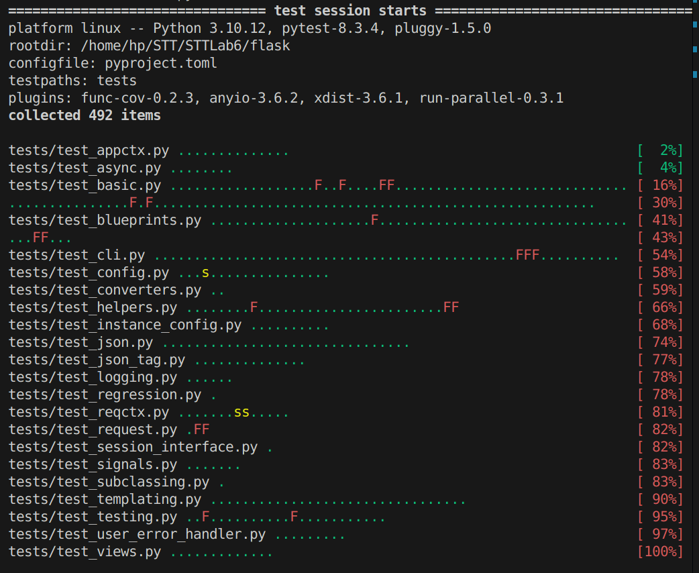

After disabling failing tests:

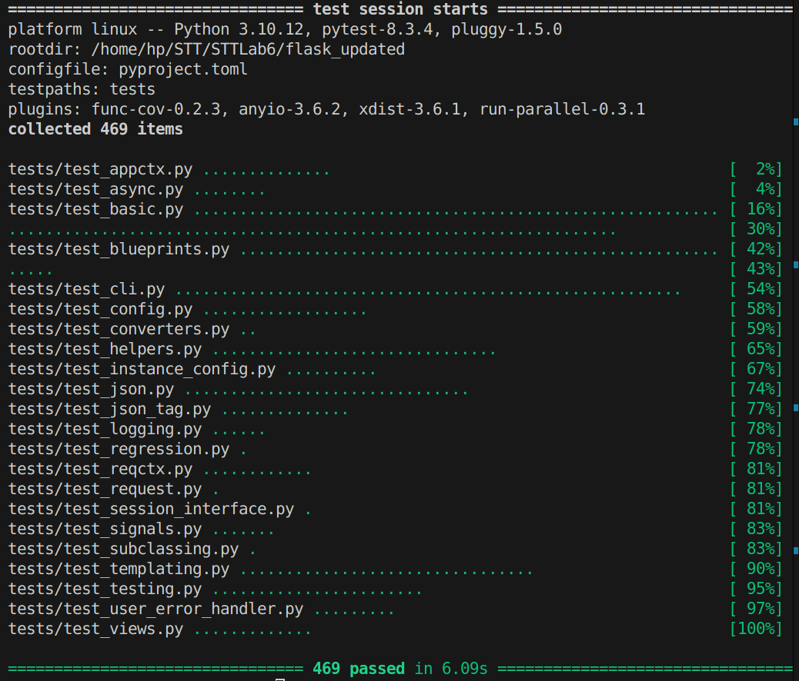

execution times on running all tests, and doing this 3 times are :

|Turn| time (s)   |
|----|------------|
|1   | 6.05       |
|2   | 6.55       |
|3   | 5.78       |
|**Mean**|**6.13**|

### Sequential Test execution for Algorithms

There was a small error in the test suite. After fixing that, I proceeded as usual.

Before disabling failing tests:

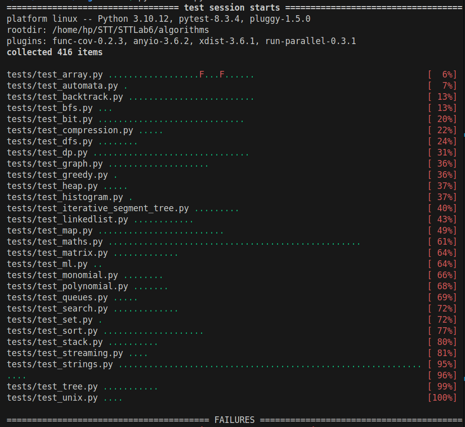

After disabling failing tests:

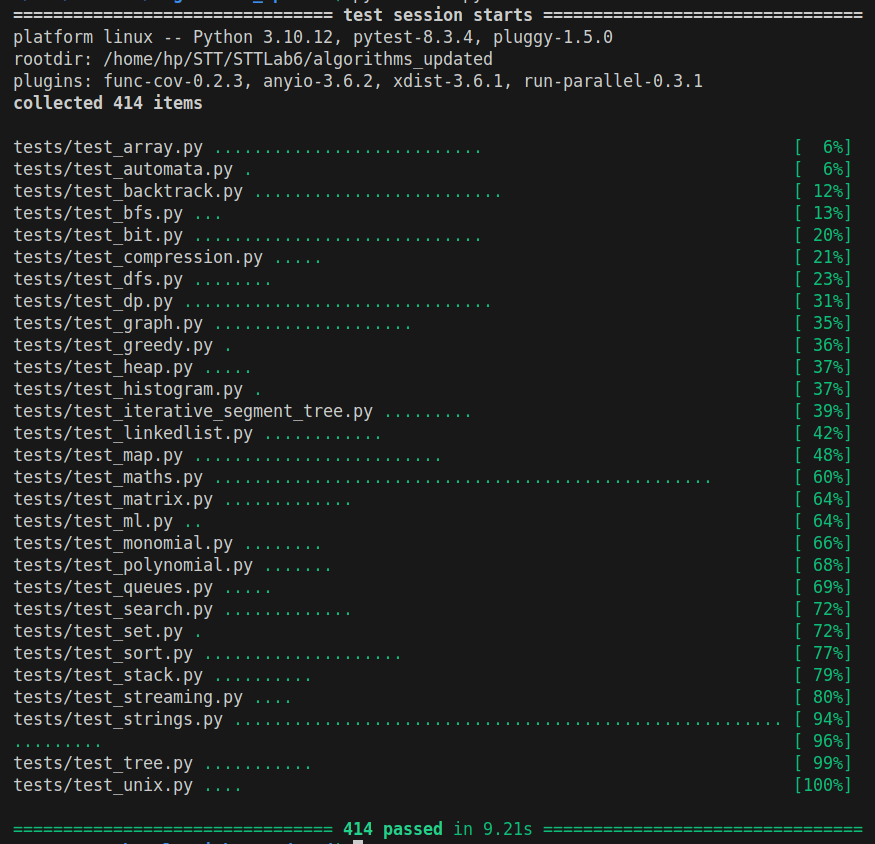

execution times on running all tests, and doing this 3 times are :

|Turn| time (s)   |
|----|------------|
|1   | 8.20       |
|2   | 8.58       |
|3   | 8.49       |
|**Mean**|**8.42**|

### Parallel Test execution for Flask

The PyPI package `pytest-xdist` extends `pytest`'s functionality by adding thread level and process level parallelism.

An example of process level parallelism is as follows:

```sh
pytest -n auto
```

This generates output like this:

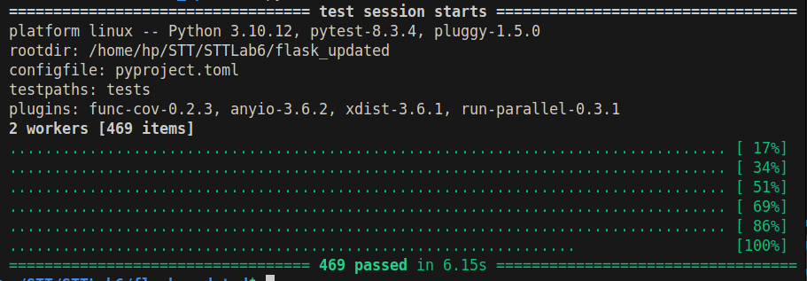

Running this 3 times gives :

|Turn| time (s)   |
|----|------------|
|1   | 6.15       |
|2   | 6.14       |
|3   | 7.07       |
|**Mean**|**6.45**|

### Parallel Test execution for Algorithms

```sh
python3 -m pytest tests -n auto
```

outputs :

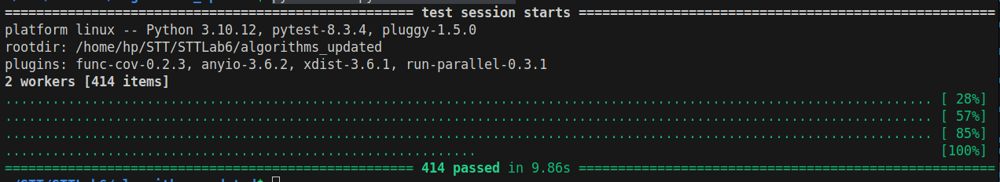

Running this 3 times gives :

|Turn| time (s)   |
|----|------------|
|1   | 9.86       |
|2   | 9.42       |
|3   | 9.50       |
|**Mean**|**9.59**|

### Observations

As you can see, instead of the run-time getting reduced, it increased slightly. This is because initializing the extra workers takes a lot of time, and during that time,
execution proceeds as if it is just serial execution, except with an overhead. This is a known and [discussed](https://github.com/pytest-dev/pytest-xdist/issues/346) flaw in `pytest-xdist` . 

### Flask `pytest` testing with different parameters

#### Process level parallelism

```sh
pytest -n auto --dist load
```
gives run-times of 6.16, 6.43, 6.21 seconds and thus mean of 6.50s

```sh
pytest -n auto --dist no
```
gives run-times of 6.61, 6.34, 6.57 seconds and thus mean of 6.50s

#### Thread level parallelism

```sh
pytest --parallel-threads auto --dist load --tb=no --disable-warnings
```

gives this output :

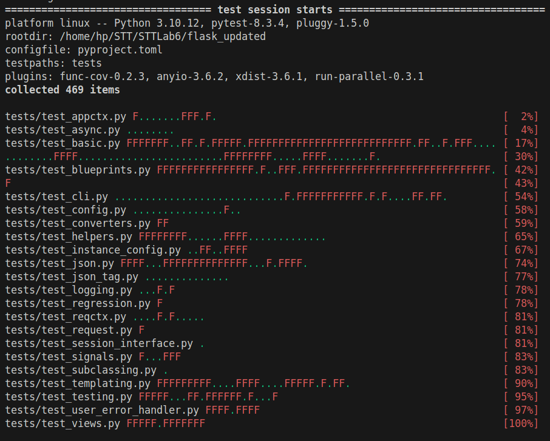

and run times of 11.63, 11.68, 12.24 seconds giving a mean of 11.85s

This is because Flask is very sensitive about timings, since it is used to deploy websites via a server.

Similarly,

```sh
pytest --parallel-threads auto --dist no --tb=no --disable-warnings
```

gives this output full of failures :

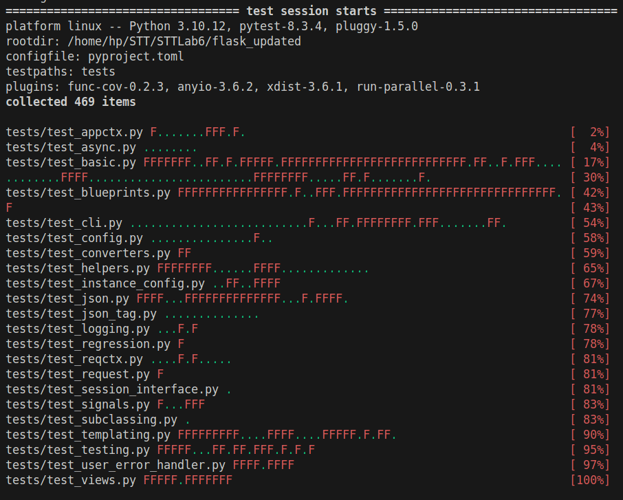

and runtimes of 11.31, 12.01, 11.61 seconds giving a mean of 11.64

### Algorithms `pytest` testing with different parameters

#### Process level parallelism

```sh
python3 -m pytest tests -n auto --dist load
```
gives run-times of 9.07, 8.54, 8.93 seconds and thus a mean of 8.85s

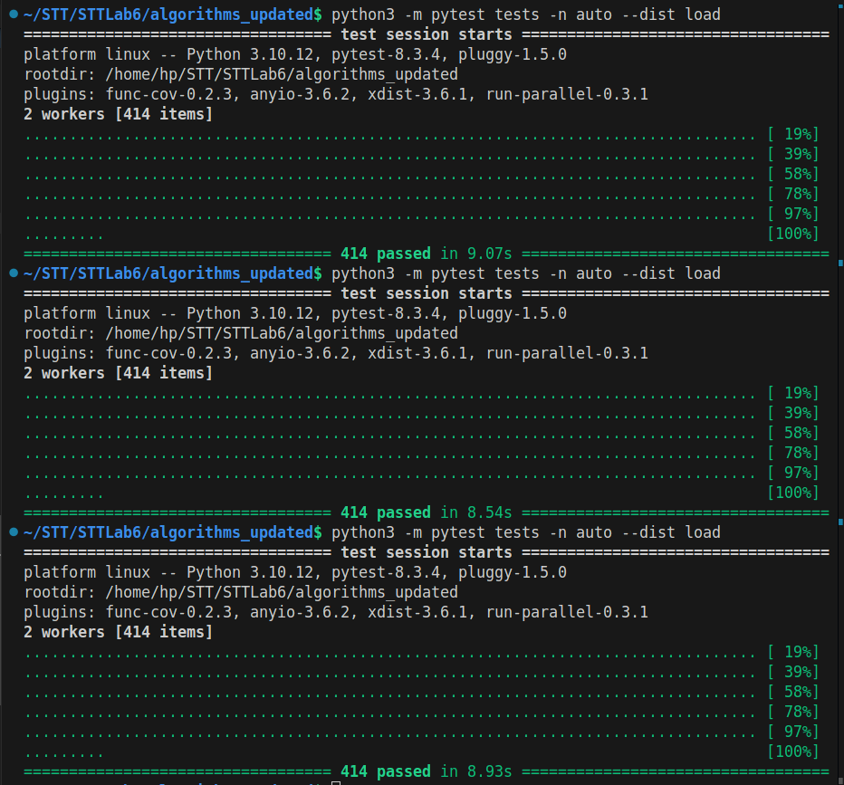

and

```sh
python3 -m pytest tests -n auto --dist no
```
gives run-times of 8.34, 8.54, 17.80 seconds and thus a mean of 11.56s

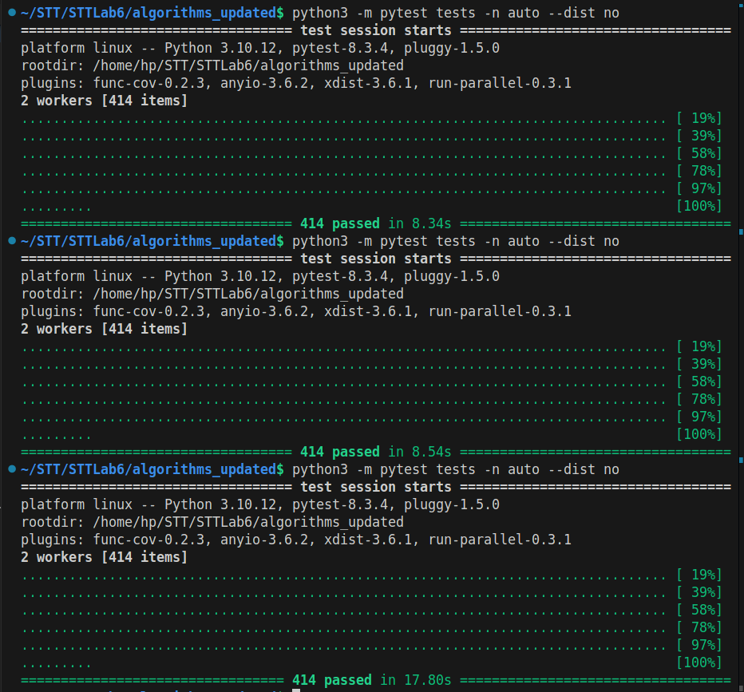

This abnormally high amount of time in one of the executions is attributed to the time needed to allocate workers, since we are running CPU intensive workloads, which, unfortunately puts our workload at the lowest priority for the OS.

#### Thread level parallelism

```sh
python3 -m pytest tests --parallel-threads auto --dist load --tb=no --disable-warnings
```

gives this output :

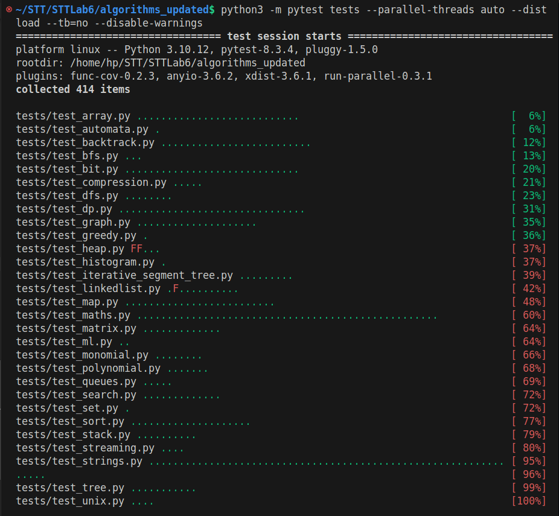
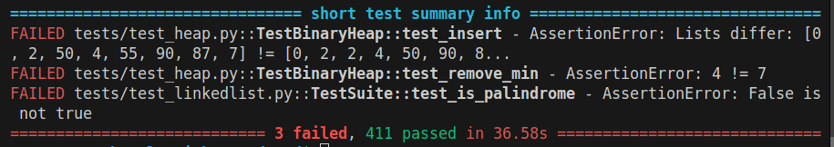

Although there aren't a lot of failures, this suggests that either `keon/algorithms` contains code which does not take 
multithreading into account, or the `pytest-run-parallel` developers were not careful during the implementation. With multithreading,
a lot could go wrong. In our case, we are dealing with a classic case of race conditions. Since both threads have the same address space,
the variables are not updated atomically at times, leading to problems such as more than necessary removals of elements from lists,
value of a counter variable being less than what it should be, etc. . Similar things are happening here.

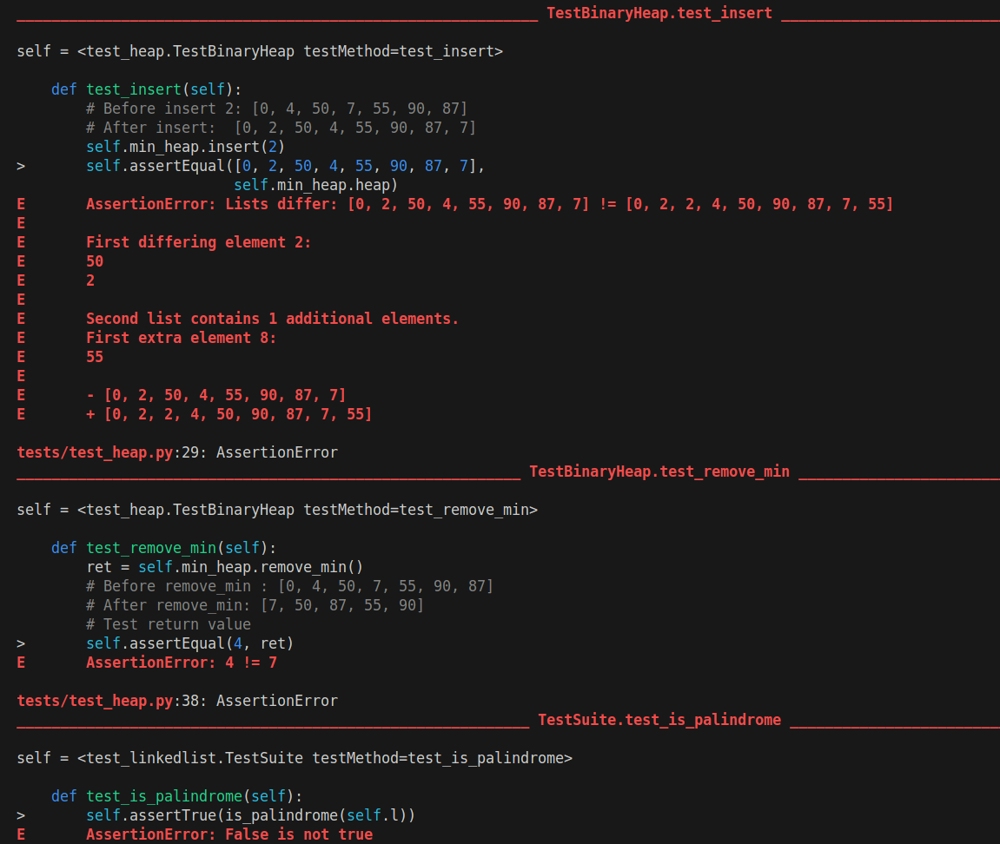

This can be solved by using locks while writing the threads.

Now, the run-times for this are 37.10, 38.90, 36.98 seconds giving a mean of 37.66s

Similarly,

```sh
python3 -m pytest tests --parallel-threads auto --dist no --tb=no --disable-warnings
```

gives the same failures and runtimes of 37.84, 35.89, 35.03 seconds giving a mean of 36.25s

# Analysis

From the data we collected, and some more, we have this information :

### Flask

#### Run-time

| Type of parallelism            | `--dist load` | `--dist no` |
| ------------------------------ | ------------  | ----------- |
| None                           |               | 6.43        |
| Process level (2 Processes)   | 6.50          | 6.50        |
| Thread level (2 threads)       | 11.85         | 11.64       |
| Process and Thread (2 workers) | 9.29          | 10.40       |

#### Fraction of failed tests

| Type of parallelism            | `--dist load` | `--dist no`  |
| ------------------------------ | ------------  | ------------ |
| Process level (2 Processes)   | 0/469         | 0/469        |
| Thread level (2 threads)       | 247/469       | 248/469      |
| Process and Thread (2 workers) | 249/469       | 246/469      |

### Algorithms

#### Run-time

| Type of parallelism            | `--dist load` | `--dist no` |
| -----------------------------  | ------------  | ----------- |
| None                           |               | 8.42        |
| Process level (2 Processes)   | 8.85          | 11.56       |
| Thread level (2 threads)       | 37.66         | 36.25       |
| Process and Thread (2 workers) | 31.10         | 32.03       |

#### Fraction of failed tests

| Type of parallelism            | `--dist load` | `--dist no` |
| -----------------------------  | ------------  | ----------- |
| Process level (2 Processes)   | 0/414         | 0/414       |
| Thread level (2 threads)       | 3/414         | 3/414       |
| Process and Thread (2 workers) | 3/414         | 3/414       |

# Conclusion

As is evident from the data, process level parallelism doesn't introduce more failures in the tests.
This is because each process has its own virtual address space. Thus, the processes can run as if they are on separate CPUs.
Meanwhile, for threads, we need concurrency control and execution ordering to ensure correct functioning and avoid race conditions.
This is to handled by the programmer, using the concurrency control API that the OS provides.
The programmer also has to avoid deadlocks and other hazards.

theoretically, multithreading and multiprocessing should increase the throughput, but here we see the opposite. This can be explained as:
1. Multithreading causes incorrect program execution here, since there are no declared critical sections in most files.Thus, many instructions that should've ran atomically, don't.
   This changes the run-time of the program directly, as its execution is altered.
2. For CPU intensive workloads, such as one in the Algorithms repository, having parallelism doesn't produce a speed-up, since now, both cores run both IO intensive and CPU intensive jobs,
   compared to one running IO intensive jobs predominantly, and other running CPU intensive jobs
   There can be a lot of context switching, but it doesn't change the fact, that the combined workload (system + jobs) is the same, AND the processing power is also still the same.
   In-fact, if anything, having multiple processes causes more problems due to the context switching, and the cache losing its usefulness constantly.
   Meanwhile, for IO intensive jobs, since the delay time is reduced, so the job finishes quicker theoretically.
   In practice, because of the overheads involved with acquiring the workers, the execution time is similar to sequential execution.

# Suggestions to the `pytest` developers :

Although the process and thread level parallelism are nice features to have, if they don't produce a speed-up, no one will use them.
So, improving the run-times for execution with parallelism is a necessary advancement.
